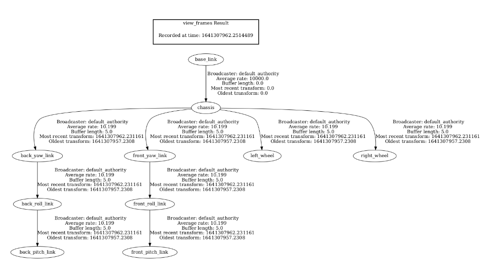

# Construindo um modelo visual de robô com URDF
* Aprenda os fundamentos dos arquivos URDF
* Visualize o modelo do robô no RVIZ
* Mova as juntas através de um Joint State Publisher

Nesta unidade, você aprenderá como criar uma representação visual de um robô no formato URDF. Usando um visual, entenda que não é um modelo de simulação de trabalho físico. É apenas o esqueleto do que, no final, será usado para simulação. No entanto, esse modelo visual URDF já é útil.

Se você tem um robô real e deseja usar a infraestrutura do ROS, precisa de uma descrição virtual de como o robô está conectado e onde cada um dos sensores está em algumas aplicações. Por exemplo, se você tiver uma câmera montada na cabeça do robô, através da descrição do robô virtual (o arquivo URDF), você pode usar a estrutura TF ROS para saber exatamente onde a câmera está baseada apenas nas leituras dos sensores da junta. Também permite representar o modelo do robô dentro do RVIZ.

Comece criando o URDF de um robô imaginário chamado box_bot e siga estas etapas:

* Aprenda a usar as ferramentas de criação de URDF e o procedimento passo a passo para criar um modelo de robô.
* Aprenda sobre a morfologia do robô com o qual você deseja trabalhar.
* Obtenha os modelos 3D necessários no formato correto.
* Gere o link e a estrutura conjunta.
* Teste o movimento das articulações.

## O que é o formato URDF?
URDF significa Universal Robot Description Format, que é uma maneira elegante de dizer que é um formato para definir a estrutura de um robô. Defina os seguintes itens:

* Articulações e ligações que formam a estrutura de um robô
* Formas e malhas atribuídas a cada um desses links
* Sensores que possui e a que link estão conectados
* Diferentes propriedades físicas que cada link tem para simular o robô corretamente no Gazebo

O formato URDF usa a sintaxe XML.

## Ligações e Juntas
Vamos criar o arquivo URDF na estrutura ROS apropriada e um pacote ROS2 para cada modelo de robô que você criar.

Nesse caso, crie um pacote ROS2 chamado `my_box_bot_description`. É comum criar um pacote `my_robot_description` para armazenar todos os arquivos que descrevem o robô. Este pacote robotname_description está em todos os pacotes ROS2 que definem modelos de robôs.

```bash
cd ~/ros2_ws/src
ros2 pkg create --build-type ament_cmake my_box_bot_description --dependencies urdf xacro
```
Depois de ter o pacote `my_box_bot_description`, crie as seguintes pastas dentro dele para serem usadas nesta unidade:
```bash
cd ~/ros2_ws/src/my_box_bot_description
mkdir launch rviz urdf
```
Você precisará dessas pastas para ter um robô simulado totalmente funcional.
Agora, crie um arquivo URDF chamado `box_bot_simple.urdf` na pasta urdf.
```bash
cd ~/ros2_ws/src/my_box_bot_description/urdf
touch box_bot_simple.urdf
```

> box_bot_simple.urdf
Esta versão será apenas um link BOX chamado chassis vinculado a `base_link` com uma junta fixa.
```xml
<?xml version="1.0"?>
<robot name="box_bot">
        
  <link name="base_link">
  </link>

  <link name="chassis">
    <visual>
      <geometry>
        <box size="0.1 0.1 0.1"/>
      </geometry>
    </visual>
  </link>

  <joint name="base_link_joint" type="fixed">
    <origin rpy="0 0 0" xyz="0 0 0" />
    <parent link="base_link" />
    <child link="chassis" />
  </joint>
  
</robot>
```
Todas as medições em URDF estão no Sistema Internacional de Unidades:

* **meters** de distância
* **radians** para ângulos
* **kilograms** de peso

Três formas geométricas básicas podem definir links: caixa, cilindro e esfera.
```xml
<cylinder radius="0.06" length="0.09"/>
<box size="0.0005 0.0005 0.0005"/> x-length,y-legth and z-length
<sphere radius="0.06"/>
```

Nesse caso, você usou uma caixa com dimensão de 0,1 em todos os lados.

Observe que apenas o link do chassi possui um elemento visual. Isso não é obrigatório para criar um URDF, apenas se você quiser uma representação visual do link. Caso contrário, aparecerá um quadro, nada mais.

Links sem visuais são amplamente utilizados para posicionamento de quadros de sensores e links auxiliares entre outros links.

Este é um caso especial porque é recomendado usar um primeiro link denominado link base em todos os modelos URDF.

No exemplo dado, você tem dois links:

* **base_link**: Este é o link raiz, o pai de onde todos os links serão suspensos. Tem que ser ÚNICO.
* **chassis**: Este é o link que representa o chassis do seu box_bot, uma caixa de 0,1 metros de cada lado.
E uma articulação:

* **base_link_joint**: Esta é uma junta fixa, o que significa que NÃO há movimento, e apenas conecta um link a outro de forma estática. No entanto, as articulações podem se mover. São as articulações do robô.

```xml
<joint name="base_link_joint" type="fixed">
    <origin rpy="0 0 0" xyz="0 0 0" />
    <parent link="base_link" />
    <child link="chassis" />
  </joint>
```
Os principais elementos para definir uma junta são:

Tipo:
* revolução
* contínuo
* prismático
* fixo (igual ao exemplo)
* flutuando
* planar

Você pode aprender mais aqui em http://wiki.ros.org/urdf/XML/joint. A seleção do tipo de junta dependerá de como o modelo físico do seu robô se move.

* **Parent and Child**: Aqui é onde você define quem está conectado ao seu link. Nesse caso, era base_link, o pai do chassi.

* **Origin**: Todas as coordenadas e RPY são referenciadas ao eixo Pai, não ao eixo Filho. Nesse caso, a estrutura do link do chassi está no mesmo local que o base_link.

Existem algumas outras tags que você não precisa nas juntas do tipo fixo:

* **Limit**: Este é um elemento importante, especialmente ao controlar o movimento de um robô.
* **Axis**: Aqui, defina em torno de qual EIXO do FILHO o link Filho irá girar. Isso, é claro, depende do tipo de junta; alguns deles não possuem tags de eixo porque são irrelevantes, como a junta fixa. Este é o eixo de rotação para juntas de revolução, o eixo de translação para juntas prismáticas e a superfície normal para juntas planas.

## Criando um arquivo de inicialização para o modelo URDF
Feito isso, é hora de ver o resultado. Para saber como o ROS2 vai ver o modelo e para te ajudar a posicionar os elos e juntas, utilize o seguinte launch. Primeiro, crie um arquivo chamado `urdf_visualize.launch.py` dentro do diretório do pacote de inicialização.

```bash
cd ~/ros2_ws/src/my_box_bot_description/launch
touch urdf_visualize.launch.py
chmod +x urdf_visualize.launch.py
```

Agora, configure alguns elementos no arquivo `CMakeLists.txt` no pacote para executar este lançamento. Primeiro, você deve dizer a ele para instalar a pasta launch. Você deve ter algo assim:

> CMakeLists.txt
```cmake
cmake_minimum_required(VERSION 3.8)
project(my_box_bot_description)

if(CMAKE_COMPILER_IS_GNUCXX OR CMAKE_CXX_COMPILER_ID MATCHES "Clang")
  add_compile_options(-Wall -Wextra -Wpedantic)
endif()

# find dependencies
find_package(ament_cmake REQUIRED)
find_package(urdf REQUIRED)
find_package(xacro REQUIRED)

if(BUILD_TESTING)
  find_package(ament_lint_auto REQUIRED)
  ament_lint_auto_find_test_dependencies()
endif()

install(
  DIRECTORY
    urdf
    rviz
    launch
  DESTINATION
    share/${PROJECT_NAME}/
)

ament_package()
```
Como você pode ver, você está instalando as três pastas que criou:
```cmake
install(
  DIRECTORY
    urdf
    rviz
    launch
  DESTINATION
    share/${PROJECT_NAME}/
)
```
Compile para instalá-lo no sistema para iniciá-lo. Lembre-se de que você terá que fazer isso CADA vez que mudar alguma coisa; caso contrário, as alterações não serão refletidas no script em execução.
```bash
cd ~/ros2_ws
rm -rf build install log
```
Source o arquivo de setup e compile o pacote.

```bash
source /home/simulations/ros2_sims_ws/install/setup.bash
colcon build
```
Agora você pode compilar normalmente:
```bash
colcon build --packages-select my_box_bot_description
source install/setup.bash
```
Agora, adicione o seguinte código a `urdf_visualize.launch.py`.

> urdf_visualize.launch.py
```python
import os

from ament_index_python.packages import get_package_share_directory
from launch import LaunchDescription
from launch.substitutions import Command
from launch_ros.actions import Node

# this is the function launch  system will look for
def generate_launch_description():

    ####### DATA INPUT ##########
    urdf_file = 'box_bot_simple.urdf'
    #xacro_file = "box_bot.xacro"
    package_description = "my_box_bot_description"

    ####### DATA INPUT END ##########
    print("Fetching URDF ==>")
    robot_desc_path = os.path.join(get_package_share_directory(package_description), "urdf", urdf_file)

    # Robot State Publisher

    robot_state_publisher_node = Node(
        package='robot_state_publisher',
        executable='robot_state_publisher',
        name='robot_state_publisher_node',
        emulate_tty=True,
        parameters=[{'use_sim_time': True, 'robot_description': Command(['xacro ', robot_desc_path])}],
        output="screen"
    )

    # create and return launch description object
    return LaunchDescription(
        [            
            robot_state_publisher_node
        ]
    )
```
Aqui, vamos comentar alguns elementos:
```python
####### DATA INPUT ##########
urdf_file = 'box_bot_simple.urdf'
#xacro_file = "box_bot.xacro"
package_description = "my_box_bot_description"

####### DATA INPUT END ##########
print("Fetching URDF ==>")
robot_desc_path = os.path.join(get_package_share_directory(package_description), "urdf", urdf_file)
```
Aqui, você está procurando o caminho absoluto para o arquivo URDF que deseja usar. Nesse caso, você deseja o arquivo URDF `box_bot_simple.urdf` dentro do pacote `my_box_bot_description`.

```python
# Robot State Publisher

robot_state_publisher_node = Node(
    package='robot_state_publisher',
    executable='robot_state_publisher',
    name='robot_state_publisher_node',
    emulate_tty=True,
    parameters=[{'use_sim_time': True, 'robot_description': Command(['xacro ', robot_desc_path])}],
    output="screen"
)
```
Aqui, instancie um nó que você chamará de robot_state_publisher_node que inicia o robot_state_publisher.

No ROS2, tem o papel de:

Publicando todas as juntas FIXED dos TFs de um arquivo `URDF/XACRO`. Isso é o mesmo que no ROS1.
Publicar no tópico `/robot_description` o arquivo URDF fornecido por meio do parâmetro `robot_description`. Isso permitirá, em teoria, que você atualize novamente a descrição do robô com qualquer alteração que fizer na estrutura, mas não abordaremos esse tópico avançado aqui.
```python
Command(['xacro', robot_desc_path])
```
Observe este comando de método. Isso é usado para executar qualquer comando shell. Nesse caso, você está chamando o binário XACRO com o argumento do caminho absoluto para o arquivo URDF. O binário XACRO é usado para processar arquivos URDF e XACRO.

O equivalente a isso diretamente no shell seria:
```bash
xacro /home/user/ros2_ws/src/my_box_bot_description/urdf/box_bot_simple.urdf
```
Inicie o RVIZ2 para visualizar o modelo do robô. Comece iniciando o arquivo de inicialização e o RVIZ:
```bash
cd ~/ros2_ws
colcon build --packages-select my_box_bot_description
source install/setup.bash
ros2 launch my_box_bot_description urdf_visualize.launch.py
```
## Visualizando um modelo URDF no Rviz2
```bash
cd ~/ros2_ws
source install/setup.bash
rviz2
```
Este comando inicia uma sessão RVIZ2 vazia, à qual você adicionará as representações TF e Robot Model. Ele deve abrir as Ferramentas Gráficas após aproximadamente 15 segundos.

Você terá que adicionar dois elementos de exibição em RVIZ2:

* Modelo de Robô
* VF

**Adicionando elementos de exibição**:

Aguarde até que a janela do RVIZ2 seja exibida e maximize-a em sua tela.
Para adicionar uma exibição, clique no botão Adicionar na parte inferior do painel lateral esquerdo. Você verá uma lista de diferentes tipos de exibição oferecidos na janela emergente que aparecerá. Percorra a lista até encontrar Robot Model. E então clique em OK. RobotModel agora deve aparecer no painel lateral esquerdo do RVIZ. Repita o procedimento para adicionar TF ao painel lateral esquerdo do RVIZ.

Configuração:

Moldura fixa: Na parte superior do painel lateral esquerdo, clique no triângulo preto à esquerda de Opções globais para `view/hide` os detalhes das Opções globais. Um dos elementos que serão exibidos é o campo Fixed Frame com `map` como valor padrão. Clique no campo e você verá um cursor piscando no texto. Defina como valor `base_link` e pressione 'enter'.

Modelo do Robô: Neste caso, clique no triângulo preto à esquerda do Modelo do Robô para abrir os detalhes. Role para baixo e confirme se a Origem da descrição está definida como tópico. Em seguida, clique no espaço vazio em branco à esquerda do tópico de descrição e digite `/robot_description`. Em seguida, clique no triângulo preto à esquerda do tópico de descrição para ver mais campos. Defina a política de confiabilidade como confiável e a política de durabilidade como local transitório.

Ao concluir essas etapas, você deve ter algo semelhante a isto:

A caixa vermelha que você vê na janela de exibição principal é o modelo de robô que construímos até agora. Estaremos usando o Rviz para visualizar o progresso da criação do modelo do robô ao longo da seção.

Agora salve a configuração do Rviz para uso posterior. Vá para Arquivo, em seguida, Salvar configuração como, navegue até o pacote `my_box_bot_description` e dentro da pasta rviz. Use como nome de arquivo urdf_vis.rviz e clique em 'Salvar'.

## Quadros TF modelo URDF
Você também pode visualizar a estrutura TF do modelo de robô usando uma visualização chamada árvore TF.

```bash
cd ~/ros2_ws
source install/setup.bash
ros2 run tf2_tools view_frames
```

Deve ter gerado dois arquivos denominados frames.pdf e frames.gv. Você pode baixá-los com o IDE. Se você abrir o `frames.pdf`, deverá obter algo semelhante ao seguinte:

Além disso, vamos dar uma olhada em mais algumas informações sobre o `robot_state_publisher` usando estes comandos:

Use a tag detalhada para visualizar todas as informações sobre o tópico `/robot_description`.
```bash
cd ~/ros2_ws
source install/setup.bash
ros2 topic info /robot_description --verbose
```

Como você pode ver:

* O Publicador é robot_state_publisher_node.
* O Assinante é RVIZ2. Dessa forma, você pode ver o modelo do robô no RVIZ2.

Agora você pode modificar o `urdf_visualize.launch.py`, criando uma versão que também lance o RVIZ2 que você chamará de `urdf_visualize_rviz.launch.py`:

>  urdf_visualize_rviz.launch.py
```python
import os

from ament_index_python.packages import get_package_share_directory
from launch import LaunchDescription
from launch.substitutions import Command
from launch_ros.actions import Node

# this is the function launch  system will look for
def generate_launch_description():

    ####### DATA INPUT ##########
    urdf_file = 'box_bot_simple.urdf'
    #xacro_file = "box_bot.xacro"
    package_description = "my_box_bot_description"

    ####### DATA INPUT END ##########
    print("Fetching URDF ==>")
    robot_desc_path = os.path.join(get_package_share_directory(package_description), "urdf", urdf_file)

    # Robot State Publisher

    robot_state_publisher_node = Node(
        package='robot_state_publisher',
        executable='robot_state_publisher',
        name='robot_state_publisher_node',
        emulate_tty=True,
        parameters=[{'use_sim_time': True, 'robot_description': Command(['xacro ', robot_desc_path])}],
        output="screen"
    )

    # RVIZ Configuration
    rviz_config_dir = os.path.join(get_package_share_directory(package_description), 'rviz', 'urdf_vis.rviz')


    rviz_node = Node(
            package='rviz2',
            executable='rviz2',
            output='screen',
            name='rviz_node',
            parameters=[{'use_sim_time': True}],
            arguments=['-d', rviz_config_dir])

    # create and return launch description object
    return LaunchDescription(
        [            
            robot_state_publisher_node,
            rviz_node
        ]
    )
```
Você pode vê-lo aqui:
```python
# RVIZ Configuration
rviz_config_dir = os.path.join(get_package_share_directory(package_description), 'rviz', 'urdf_vis.rviz')


rviz_node = Node(
        package='rviz2',
        executable='rviz2',
        output='screen',
        name='rviz_node',
        parameters=[{'use_sim_time': True}],
        arguments=['-d', rviz_config_dir])
```
Você recuperou o caminho para o arquivo de configuração salvo do RVIZ urdf_vis.rviz e iniciou o RVIZ2 com esse caminho como um argumento.

Agora, brinque com o modelo básico alterando o seguinte:

* Posição do cubo de link visual
* Posição da articulação
* Cor do cubo


**Origem visual**

Para alterar a posição e orientação do link visual, adicione a tag de origem, assim:
```xml
  <link name="chassis">
    <visual>
      <origin rpy="0 0 0" xyz="0 0 1.0"/>
      <geometry>
        <box size="0.1 0.1 0.1"/>
      </geometry>
    </visual>
  </link>
```
É baseado no eixo XYZ do link. Podem ver essas molduras no `RVIZ`, e têm cores. X = `EIXO` da cor `VERMELHA`, Y = EIXO da cor `VERDE` e Z = `EIXO` da cor `AZUL`.
Quanto ao RPY (Roll, Pitch e Yaw ), Roll = rotação no eixo X, Pitch = rotação no eixo Y e Yaw = rotação no eixo Z.

No código acima, você está movendo o elemento visual 1,0 metro no eixo Z do link do chassi.

Articulações
As juntas representam conexões entre elos/quadros de referência. Para alterar a posição e a orientação da junta, você pode fazer o seguinte:

```xml
<joint name="base_link_joint" type="fixed">
    <origin rpy="0 0 0" xyz="1.0 0 0" />
    <parent link="base_link" />
    <child link="chassis" />
</joint>
```
Aqui você está colocando a junta entre o link pai (base_link) e o filho (link do chassi) em uma posição de 1,0 metro na direção do eixo X de onde o link pai está localizado.

Cor
Para alterar a cor no URDF, defina um material e atribua-o à geometria, assim:

```xml
<material name="yellow">
    <color rgba="1.0 1.0 0.0 1"/>
</material>

<link name="chassis">
    <visual>
      <origin rpy="0 0 0" xyz="0 0 1.0"/>
      <geometry>
        <box size="0.1 0.1 0.1"/>
      </geometry>
      <material name="yellow"/>
    </visual>
</link>
```
A cor é definida usando o sistema RGBA usando uma escala de 0 a 1 em vez de 0 a 255. Saiba mais sobre RGBA nestes sites:
* https://www.w3schools.com/css/css3_colors.asp
* https://www.w3schools.com/css/tryit.asp?filename=trycss3_color_rgba

Observe que o ROS2 ainda tem alguns problemas, portanto, verifique se não há nenhum nó em execução quando você interrompe seus arquivos de inicialização; caso contrário, pode gerar conflitos e falhas.
```bash
ros2 node list
```
O arquivo URDF deve ser algo como isto:
> box_bot_simple1.urdf

```xml
<?xml version="1.0"?>
<robot name="box_bot">
        
  <material name="yellow">
        <color rgba="1.0 1.0 0.0 1"/>
  </material>


  <link name="base_link">
  </link>

  <link name="chassis">
    <visual>
      <origin rpy="0 0 0" xyz="0 0 1.0"/>
      <geometry>
        <box size="0.1 0.1 0.1"/>
      </geometry>
      <material name="yellow"/>
    </visual>
  </link>

  <joint name="base_link_joint" type="fixed">
    <origin rpy="0 0 0" xyz="1.0 0 0" />
    <parent link="base_link" />
    <child link="chassis" />
  </joint>
  
</robot>
```
### Lançar arquivo

> urdf_visualize_rviz1.launch.py

Altere o nome do URDF que você usará:
```python
    ...
####### DATA INPUT ##########
urdf_file = 'box_bot_simple_ex1-1.urdf'
...
```
## Morfologia do Robô e Publicador Joint State
Agora crie a estrutura básica final do robô. Veja o robô que deseja construir, analise suas juntas e crie uma nova URDF representativa.

Como você pode ver, este robô tem as seguintes partes:

* **Corpo**: É a caixa que, neste caso, você vê com um rosto sorridente de malha.
* **Rodas direita e esquerda**: Essas rodas são as que possuem motores.
* **Rodízios dianteiros/traseiros**: São rodas livres que evitam que o corpo bata no chão durante o movimento.
Agora vamos falar sobre o funcionamento das diferentes partes, especialmente os rodízios:

Você precisa de DUAS juntas, uma para cada roda, continuamente. Você precisa que eles gire em uma direção mais de 360 graus. Essas juntas devem girar em torno do eixo perpendicular à roda.

Agora você precisa definir as rodas do rodízio. Essas esferas devem girar mais de 360 graus, portanto, devem ser contínuas. Além disso, você precisa que o rodízio gire nos três eixos, não apenas em um. No formato URDF, não há suporte para juntas ESFÉRICAS (nos formatos SDF, há). Isso significa que você precisará definir três juntas diferentes que giram em cada um dos eixos para que, ao final, o rodízio se comporte como uma junta esférica.

Aqui você tem uma demonstração de como essas juntas de rodízio funcionam:

### Editora conjunta do estado ou editora do estado do robô?
Esses dois editores se confundem muito.

Todos os links conectados com juntas FIXAS conhecem suas posições relativas ao usar um modelo de robô. Então você pode publicar seus quadros TF no tópico TF. O Publisher encarregado de fazer isso é o Robot State Publisher.

No entanto, o que acontece quando as articulações se movem? O Robot State Publisher não pode saber onde eles estão, a menos que alguém publique o ângulo dessa junta. Em sistemas reais, os decodificadores dos motores que movem essas juntas serão publicados no tópico joint_states, e o Robot State Publisher saberá onde publicar o TF para todos os links que dependem dessa junta.

Alguém tem que publicar essas juntas porque não tem simulação aqui.

Aqui é onde o Joint State Publisher entra em jogo, e o `joint_state_publisher_gui`.

Este nó permite definir manualmente o estado da junta, deixando disponível o TFS para todos os elementos.

Este é o comando para iniciá-lo. Você vai usá-lo no próximo exemplo.
```bash
cd ~/ros2_ws
source install/setup.bash
ros2 run joint_state_publisher_gui joint_state_publisher_gui
```
Caso você utilize os lançamentos anteriores, por não possuírem `JUNTAS NÃO FIXAS`, não aparecerá nenhuma opção quando aparecer as Ferramentas Gráficas:

Crie um novo arquivo URDF com juntas móveis:

Crie os seguintes novos arquivos:

* box_bot_geometric.urdf: Arquivo com os novos links e elementos descritos.
* urdf_visualize_geometric.launch.py: Um novo lançamento publicado em robot_description - o novo modelo box_bot_geometric.urdf.

São necessários os seguintes links:

* base_link
* chassis
* roda_esquerda
* roda_direita
* front_yaw_link, back_yaw_link
* front_roll_link, back_roll_link
* front_picth_link, back_pitch_link

São necessárias as seguintes juntas:

* front_pitch_joint, back_pitch_joint: conecta front/back_roll_link com front/back_pitch_link
* front_roll_joint, back_roll_joint: conecta front/back_yaw_link com front/back_roll_link
* front_yaw_joint, back_yaw_joint: Conecta o chassi com front/back_yaw_link
* joint_right_wheel: conecta o chassi com a roda direita
* joint_left_wheel: Conecta o chassi com left_wheel
* base_link_joint: conecta base_link com chassis

Todos os tipos de juntas que devem se mover devem ser do tipo contínuo.

Você deve obter uma árvore TF mais ou menos assim:

<div align="center">
     
</div>

Você deve ter algo parecido com isso:

> box_bot_geometric.urdf

```xml
<?xml version="1.0"?>
<robot name="box_bot">
        
  <material name="red">
      <color rgba="1.0 0.0 0.0 1"/>
  </material>

  <material name="green_light">
      <color rgba="0.0 1.0 0.0 1"/>
  </material>

  <material name="green_dark">
    <color rgba="0.0 0.5 0.0 1"/>
  </material>

  <material name="blue">
      <color rgba="0.0 0.0 1.0 1"/>
  </material>

  <material name="yellow">
      <color rgba="1.0 1.0 0.0 1"/>
  </material>

  <material name="black">
      <color rgba="0.0 0.0 0.0 1"/>
  </material>

  <material name="white">
      <color rgba="1.0 1.0 1.0 1"/>
  </material>

  <material name="box_bot_blue">
      <color rgba="0.088656 0.428691 0.491021 1"/>
  </material>

  <link name="base_link">
  </link>


  <!-- Body -->
  <link name="chassis">
    <visual>
      <geometry>
        <box size="0.1 0.1 0.1"/>
      </geometry>
      <material name="box_bot_blue"/>
    </visual>
  </link>

  <joint name="base_link_joint" type="fixed">
    <origin rpy="0 0 0" xyz="0 0 0" />
    <parent link="base_link" />
    <child link="chassis" />
  </joint>

  <!-- Wheel Left -->
  <link name="left_wheel">      
      <visual>
        <origin rpy="0 1.5707 1.5707" xyz="0 0 0"/>
        <geometry>
          <cylinder length="0.001" radius="0.035"/>
        </geometry>
        <material name="black"/>
      </visual>
  </link>

  <joint name="joint_left_wheel" type="continuous">
    <origin rpy="0 0 0" xyz="0 0.05 -0.025"/>
    <child link="left_wheel"/>
    <parent link="chassis"/>
    <axis rpy="0 0 0" xyz="0 1 0"/>
    <limit effort="10000" velocity="1000"/>
    <joint_properties damping="1.0" friction="1.0"/>
  </joint>

  <!-- Wheel Right -->
  <link name="right_wheel">      
      <visual>
        <origin rpy="0 1.5707 1.5707" xyz="0 0 0"/>
        <geometry>
          <cylinder length="0.001" radius="0.035"/>
        </geometry>
        <material name="white"/>
      </visual>
  </link>

  <joint name="joint_right_wheel" type="continuous">  
    <origin rpy="0 0 0" xyz="0 -0.05 -0.025"/>
    <child link="right_wheel"/>
    <parent link="chassis"/>
    <axis rpy="0 0 0" xyz="0 1 0"/>
    <limit effort="10000" velocity="1000"/>
    <joint_properties damping="1.0" friction="1.0"/>
  </joint>


  <!-- Caster Wheel Front -->
  <link name="front_yaw_link">
    <visual>
        <origin rpy="0 1.5707 1.5707" xyz="0 0 0"/>
        <geometry>
          <cylinder length="0.005" radius="0.010"/>
        </geometry>
        <material name="blue"/>
      </visual>
  </link>

  <joint name="front_yaw_joint" type="continuous">
    <origin rpy="0 0 0" xyz="0.04 0 -0.05" />
    <parent link="chassis" />
    <child link="front_yaw_link" />
    <axis xyz="0 0 1" />
    <limit effort="1000.0" velocity="100.0" />
    <dynamics damping="0.0" friction="0.1"/>
  </joint>


  <link name="front_roll_link">
      <visual>
        <origin rpy="0 1.5707 1.5707" xyz="0 0 0"/>
        <geometry>
          <cylinder length="0.005" radius="0.010"/>
        </geometry>
        <material name="red"/>
      </visual>
  </link>

  <joint name="front_roll_joint" type="continuous">
    <origin rpy="0 0 0" xyz="0 0 0" />
    <parent link="front_yaw_link" />
    <child link="front_roll_link" />
    <axis xyz="1 0 0" />
    <limit effort="1000.0" velocity="100.0" />
    <dynamics damping="0.0" friction="0.1"/>
  </joint>


  <link name="front_pitch_link">
    <visual>
      <origin rpy="0 1.5707 1.5707" xyz="0 0 0"/>
      <geometry>
        <sphere radius="0.010"/>
      </geometry>
      <material name="green_dark"/>
    </visual>
  </link>

  <joint name="front_pitch_joint" type="continuous">
    <origin rpy="0 0 0" xyz="0 0 0" />
    <parent link="front_roll_link" />
    <child link="front_pitch_link" />
    <axis xyz="0 1 0" />
    <limit effort="1000.0" velocity="100.0" />
    <dynamics damping="0.0" friction="0.1"/>
  </joint>

<!-- Caster Wheel Back -->
  <link name="back_yaw_link">
    <visual>
        <origin rpy="0 1.5707 1.5707" xyz="0 0 0"/>
        <geometry>
          <cylinder length="0.005" radius="0.010"/>
        </geometry>
        <material name="blue"/>
      </visual>
  </link>

  <joint name="back_yaw_joint" type="continuous">
    <origin rpy="0 0 0" xyz="-0.04 0 -0.05" />
    <parent link="chassis" />
    <child link="back_yaw_link" />
    <axis xyz="0 0 1" />
    <limit effort="1000.0" velocity="100.0" />
    <dynamics damping="0.0" friction="0.1"/>
  </joint>


  <link name="back_roll_link">
      <visual>
        <origin rpy="0 1.5707 1.5707" xyz="0 0 0"/>
        <geometry>
          <cylinder length="0.005" radius="0.010"/>
        </geometry>
        <material name="red"/>
      </visual>
  </link>

  <joint name="back_roll_joint" type="continuous">
    <origin rpy="0 0 0" xyz="0 0 0" />
    <parent link="back_yaw_link" />
    <child link="back_roll_link" />
    <axis xyz="1 0 0" />
    <limit effort="1000.0" velocity="100.0" />
    <dynamics damping="0.0" friction="0.1"/>
  </joint>


  <link name="back_pitch_link">
    <visual>
      <origin rpy="0 1.5707 1.5707" xyz="0 0 0"/>
      <geometry>
        <sphere radius="0.010"/>
      </geometry>
      <material name="green_light"/>
    </visual>
  </link>

  <joint name="back_pitch_joint" type="continuous">
    <origin rpy="0 0 0" xyz="0 0 0" />
    <parent link="back_roll_link" />
    <child link="back_pitch_link" />
    <axis xyz="0 1 0" />
    <limit effort="1000.0" velocity="100.0" />
    <dynamics damping="0.0" friction="0.1"/>
  </joint>


  
</robot>
```

> urdf_visualize_geometric.launch.py

```python
import os

from ament_index_python.packages import get_package_share_directory
from launch import LaunchDescription
from launch.substitutions import Command
from launch_ros.actions import Node

# this is the function launch  system will look for
def generate_launch_description():

    ####### DATA INPUT ##########
    urdf_file = 'box_bot_geometric.urdf'
    #xacro_file = "box_bot.xacro"
    package_description = "my_box_bot_description"

    ####### DATA INPUT END ##########
    print("Fetching URDF ==>")
    robot_desc_path = os.path.join(get_package_share_directory(package_description), "urdf", urdf_file)

    # Robot State Publisher

    robot_state_publisher_node = Node(
        package='robot_state_publisher',
        executable='robot_state_publisher',
        name='robot_state_publisher_node',
        emulate_tty=True,
        parameters=[{'use_sim_time': True, 'robot_description': Command(['xacro ', robot_desc_path])}],
        output="screen"
    )

    # RVIZ Configuration
    rviz_config_dir = os.path.join(get_package_share_directory(package_description), 'rviz', 'urdf_vis.rviz')


    rviz_node = Node(
            package='rviz2',
            executable='rviz2',
            output='screen',
            name='rviz_node',
            parameters=[{'use_sim_time': True}],
            arguments=['-d', rviz_config_dir])

    # create and return launch description object
    return LaunchDescription(
        [            
            robot_state_publisher_node,
            rviz_node
        ]
    )
```
Para executá-lo, execute os seguintes comandos:
```bash
cd ~/ros2_ws
colcon build --packages-select my_box_bot_description
source install/setup.bash
ros2 launch my_box_bot_description urdf_visualize_geometric.launch.py
```
Você terá este erro de saída:
Isso ocorre porque agora você tem articulações com posições que não conhece até saber o ângulo dessa articulação.
Inicie a GUI do Joint State Publisher. Isso eliminará os erros mencionados anteriormente.
```bash
cd ~/ros2_ws
source install/setup.bash
ros2 run joint_state_publisher_gui joint_state_publisher_gui
```
Agora você deve ter no RVIZ algo assim, ajustando um pouco o tamanho dos TF Markers e retirando os nomes, para visualizar melhor o que está acontecendo:
Veja que desativamos os nomes dos frames do TF. Para fazer isso, clique no triângulo preto à esquerda do TF para abrir os detalhes. Em seguida, desmarque a caixa de seleção `Mostrar nomes` e veja como os nomes dos quadros desaparecem.

Para alterar o tamanho dos eixos do quadro, mantenha a visualização de detalhes do TF aberta e clique no campo que está à esquerda de `Marker Scale` e substitua o valor padrão 1,0 por 0,2.

Agora vá para `Arquivo` -> `Salvar` para salvar sua configuração atual do Rviz para a próxima vez que iniciar o Rviz.

Além disso, se você abrir as Ferramentas Gráficas, deverá ter a GUI Joint State Publisher que permite mover as juntas para qualquer lugar que desejar e ver os resultados no RVIZ2. Isso é muito útil para verificar se você colocou o eixo das juntas corretamente.

## Importar e usar malhas 3D
Este é um tópico amplo e há muitas maneiras de fazê-lo. Primeiro, porém, você aprenderá os elementos básicos necessários para importar modelos 3D corretamente.

Os modelos finais devem ser salvos no formato STL, DAE ou OBJ ao usar uma ferramenta CAD. O SOLIDWORKS, por exemplo, oferece a opção de STL. Os modelos DAE salvam informações de cores e podem ter texturas associadas a eles. No entanto, isso é algo que pode ser adicionado no Blender. 

Importe o STL dos modelos DAE para o Blender. Aqui você definirá a origem do modelo e as unidades. Isso é vital. A configuração do eixo determinará o quão difícil é criar o modelo URDF. Quanto às unidades, você deve dimensioná-las adequadamente para simplificar o trabalho do URDF posteriormente.
Depois que o eixo e as unidades estiverem configurados, você pode adicionar material ao modelo do Blender para adicionar cor ou usar qualquer técnica de texturização.
Uma vez feito, exporte-o para o formato DAE. Se você usou texturas, certifique-se de que as texturas sejam exportadas no mesmo local que o arquivo DAE.
Nesse caso, você já recebeu uma malha 3D que pode ser adicionada a esse modelo URDF. Então, basta baixá-los e copiá-los para o seu pacote da seguinte forma:
```bash
cd ~/ros2_ws/src/my_box_bot_description
```
Neste exemplo, faremos o download do arquivo mesh fornecido usando o comando git clone:
```bash
git clone https://bitbucket.org/theconstructcore/course_urdf_ros2_material.git
```
Por conveniência, copiamos um diretório de um lugar para outro:
```bash
cp -r course_urdf_ros2_material/meshes ./
```
E exclua o diretório course_urdf_ros2_material, pois não é mais necessário:
```bash
rm -rf course_urdf_ros2_material
```
Para instalar a nova pasta meshes, atualize o script CMakeLists.txt do seu pacote dentro de my_box_bot_description e permita que o ROS2 o encontre.

Para sua conveniência, aqui está o código CMake completo:
> CMakeLists.txt
```cmake
cmake_minimum_required(VERSION 3.8)
project(my_box_bot_description)

if(CMAKE_COMPILER_IS_GNUCXX OR CMAKE_CXX_COMPILER_ID MATCHES "Clang")
  add_compile_options(-Wall -Wextra -Wpedantic)
endif()

# find dependencies
find_package(ament_cmake REQUIRED)
find_package(urdf REQUIRED)
find_package(xacro REQUIRED)

if(BUILD_TESTING)
  find_package(ament_lint_auto REQUIRED)
  ament_lint_auto_find_test_dependencies()
endif()

install(
  DIRECTORY
    urdf
    rviz
    launch
    meshes
  DESTINATION
    share/${PROJECT_NAME}/
)

ament_package()
```
Compile para instalá-lo no sistema:
```bash
cd ~/ros2_ws
colcon build --packages-select my_box_bot_description
source install/setup.bash
```
Ótimo! Agora altere a tag visual no URDF para adicionar a nova malha. Para isso, crie um novo arquivo URDF chamado `box_bot_geometric_meshes.urdf`. Você também precisará de um novo arquivo de inicialização que publique esse novo URDF. Chame-o de `urdf_visualize_meshes.py.launch`.

> box_bot_geometric_meshes.urdf
```xml
<?xml version="1.0"?>
<robot name="box_bot">
        
  <material name="red">
      <color rgba="1.0 0.0 0.0 1"/>
  </material>

  <material name="green_light">
      <color rgba="0.0 1.0 0.0 1"/>
  </material>

  <material name="green_dark">
    <color rgba="0.0 0.5 0.0 1"/>
  </material>

  <material name="blue">
      <color rgba="0.0 0.0 1.0 1"/>
  </material>

  <material name="yellow">
      <color rgba="1.0 1.0 0.0 1"/>
  </material>

  <material name="black">
      <color rgba="0.0 0.0 0.0 1"/>
  </material>

  <material name="white">
      <color rgba="1.0 1.0 1.0 1"/>
  </material>

  <material name="box_bot_blue">
      <color rgba="0.088656 0.428691 0.491021 1"/>
  </material>

  <link name="base_link">
  </link>


  <!-- Body -->
  <link name="chassis">
    <visual>
      <geometry>
        <mesh filename="package://my_box_bot_description/meshes/cute_cube.dae" scale="0.1 0.1 0.1"/>
      </geometry>
      <material name="box_bot_blue"/>
    </visual>
  </link>

  <joint name="base_link_joint" type="fixed">
    <origin rpy="0 0 0" xyz="0 0 0" />
    <parent link="base_link" />
    <child link="chassis" />
  </joint>

  <!-- Wheel Left -->
  <link name="left_wheel">      
      <visual>
        <origin rpy="0 1.5707 1.5707" xyz="0 0 0"/>
        <geometry>
          <cylinder length="0.001" radius="0.035"/>
        </geometry>
        <material name="red"/>
      </visual>
  </link>


  <joint name="joint_left_wheel" type="continuous">
    <origin rpy="0 0 0" xyz="0 0.05 -0.025"/>
    <child link="left_wheel"/>
    <parent link="chassis"/>
    <axis rpy="0 0 0" xyz="0 1 0"/>
    <limit effort="10000" velocity="1000"/>
    <joint_properties damping="1.0" friction="1.0"/>
  </joint>

  <!-- Wheel Right -->
  <link name="right_wheel">      
      <visual>
        <origin rpy="0 1.5707 1.5707" xyz="0 0 0"/>
        <geometry>
          <cylinder length="0.001" radius="0.035"/>
        </geometry>
        <material name="green"/>
      </visual>
  </link>


  <joint name="joint_right_wheel" type="continuous">  
    <origin rpy="0 0 0" xyz="0 -0.05 -0.025"/>
    <child link="right_wheel"/>
    <parent link="chassis"/>
    <axis rpy="0 0 0" xyz="0 1 0"/>
    <limit effort="10000" velocity="1000"/>
    <joint_properties damping="1.0" friction="1.0"/>
  </joint>


  <!-- Caster Wheel Front -->
  <link name="front_yaw_link">
      <visual>
        <origin rpy="0 1.5707 1.5707" xyz="0 0 0"/>
        <geometry>          
          <cylinder length="0.001" radius="0.0045000000000000005"/>
        </geometry>
        <material name="blue"/>
      </visual>
  </link>

  <joint name="front_yaw_joint" type="continuous">
    <origin rpy="0 0 0" xyz="0.04 0 -0.05" />
    <parent link="chassis" />
    <child link="front_yaw_link" />
    <axis xyz="0 0 1" />
    <limit effort="1000.0" velocity="100.0" />
    <dynamics damping="0.0" friction="0.1"/>
  </joint>


  <link name="front_roll_link">
      <visual>
        <origin rpy="0 1.5707 1.5707" xyz="0 0 0"/>
        <geometry>
          <cylinder length="0.001" radius="0.0045000000000000005"/>
        </geometry>
        <material name="red"/>
      </visual>
  </link>

  <joint name="front_roll_joint" type="continuous">
    <origin rpy="0 0 0" xyz="0 0 0" />
    <parent link="front_yaw_link" />
    <child link="front_roll_link" />
    <axis xyz="1 0 0" />
    <limit effort="1000.0" velocity="100.0" />
    <dynamics damping="0.0" friction="0.1"/>
  </joint>


  <link name="front_pitch_link">
    <visual>
      <origin rpy="0 1.5707 1.5707" xyz="0 0 0"/>
      <geometry>
        <sphere radius="0.010"/>
      </geometry>
      <material name="green_dark"/>
    </visual>
  </link>


  <joint name="front_pitch_joint" type="continuous">
    <origin rpy="0 0 0" xyz="0 0 0" />
    <parent link="front_roll_link" />
    <child link="front_pitch_link" />
    <axis xyz="0 1 0" />
    <limit effort="1000.0" velocity="100.0" />
    <dynamics damping="0.0" friction="0.1"/>
  </joint>

<!-- Caster Wheel Back -->
  <link name="back_yaw_link">
    <visual>
        <origin rpy="0 1.5707 1.5707" xyz="0 0 0"/>
        <geometry>
          <cylinder length="0.001" radius="0.0045000000000000005"/>
        </geometry>
        <material name="blue"/>
      </visual>

  </link>

  <joint name="back_yaw_joint" type="continuous">
    <origin rpy="0 0 0" xyz="-0.04 0 -0.05" />
    <parent link="chassis" />
    <child link="back_yaw_link" />
    <axis xyz="0 0 1" />
    <limit effort="1000.0" velocity="100.0" />
    <dynamics damping="0.0" friction="0.1"/>
  </joint>


  <link name="back_roll_link">
      <visual>
        <origin rpy="0 1.5707 1.5707" xyz="0 0 0"/>
        <geometry>
          <cylinder length="0.001" radius="0.0045000000000000005"/>
        </geometry>
        <material name="red"/>
      </visual>
  </link>

  <joint name="back_roll_joint" type="continuous">
    <origin rpy="0 0 0" xyz="0 0 0" />
    <parent link="back_yaw_link" />
    <child link="back_roll_link" />
    <axis xyz="1 0 0" />
    <limit effort="1000.0" velocity="100.0" />
    <dynamics damping="0.0" friction="0.1"/>
  </joint>


  <link name="back_pitch_link">
    <visual>
      <origin rpy="0 1.5707 1.5707" xyz="0 0 0"/>
      <geometry>
        <sphere radius="0.010"/>
      </geometry>
      <material name="green_light"/>
    </visual>
  </link>

  <joint name="back_pitch_joint" type="continuous">
    <origin rpy="0 0 0" xyz="0 0 0" />
    <parent link="back_roll_link" />
    <child link="back_pitch_link" />
    <axis xyz="0 1 0" />
    <limit effort="1000.0" velocity="100.0" />
    <dynamics damping="0.0" friction="0.1"/>
  </joint>

</robot>
```
Como você pode ver, a única diferença é esta:
```xml
<link name="chassis">
<visual>
  <geometry>
    <mesh filename="package://my_box_bot_description/meshes/cute_cube.dae" scale="0.1 0.1 0.1"/>
  </geometry>
  <material name="box_bot_blue"/>
</visual>
</link>
```
Você substitui o:
```xml
<box size="0.1 0.1 0.1"/>
```
Com:
```xml
<mesh filename="package://my_box_bot_description/meshes/cute_cube.dae" scale="0.1 0.1 0.1"/>
```
Na tag mesh, você tem dois elementos básicos:

* **filename**: Aqui, você indica onde encontrar o arquivo de malha; neste caso, você usa o atalho do pacote para informar ao sistema que ele está dentro de um pacote ROS2.
* **scale**: Aqui, você pode alterar a escala da malha. Isso é útil quando as malhas não têm a escala que deveriam, o que é normal. Nesse caso, a malha é 10 vezes maior que as dimensões que você deseja, então você a altera multiplicando por 0,1 (dividindo por 10).
Crie um novo arquivo urdf_visualize_meshes.launch.py para publicar e visualizar o novo modelo de robô no tópico /robot_description:
> urdf_visualize_meshes.launch.py
```python
import os

from ament_index_python.packages import get_package_share_directory
from launch import LaunchDescription
from launch.substitutions import Command
from launch_ros.actions import Node

# this is the function launch  system will look for
def generate_launch_description():

    ####### DATA INPUT ##########
    urdf_file = 'box_bot_geometric_meshes.urdf'
    #xacro_file = "box_bot.xacro"
    package_description = "my_box_bot_description"

    ####### DATA INPUT END ##########
    print("Fetching URDF ==>")
    robot_desc_path = os.path.join(get_package_share_directory(package_description), "urdf", urdf_file)

    # Robot State Publisher

    robot_state_publisher_node = Node(
        package='robot_state_publisher',
        executable='robot_state_publisher',
        name='robot_state_publisher_node',
        emulate_tty=True,
        parameters=[{'use_sim_time': True, 'robot_description': Command(['xacro ', robot_desc_path])}],
        output="screen"
    )

    # RVIZ Configuration
    rviz_config_dir = os.path.join(get_package_share_directory(package_description), 'rviz', 'urdf_vis.rviz')

    rviz_node = Node(
            package='rviz2',
            executable='rviz2',
            output='screen',
            name='rviz_node',
            parameters=[{'use_sim_time': True}],
            arguments=['-d', rviz_config_dir])

    # create and return launch description object
    return LaunchDescription(
        [            
            robot_state_publisher_node,
            rviz_node
        ]
    )
```
Inicie a GUI do `Joint State Publisher`. Isso eliminará os erros mencionados anteriormente.
```bash
cd ~/ros2_ws
source install/setup.bash
ros2 run joint_state_publisher_gui joint_state_publisher_gui
```
Aumente o zoom usando a roda de rolagem do mouse, agora você deve ter algo semelhante a isto:
E lá vai você! Agora você tem um arquivo URDF totalmente finalizado que inclui uma malha 3D.

Na próxima unidade, exploraremos como fazer as modificações para usá-lo no simulador Gazebo.

Isso significa que você terá que adicionar:

* colisões
* Inércias
* Propriedades físicas
* Sistemas de controle