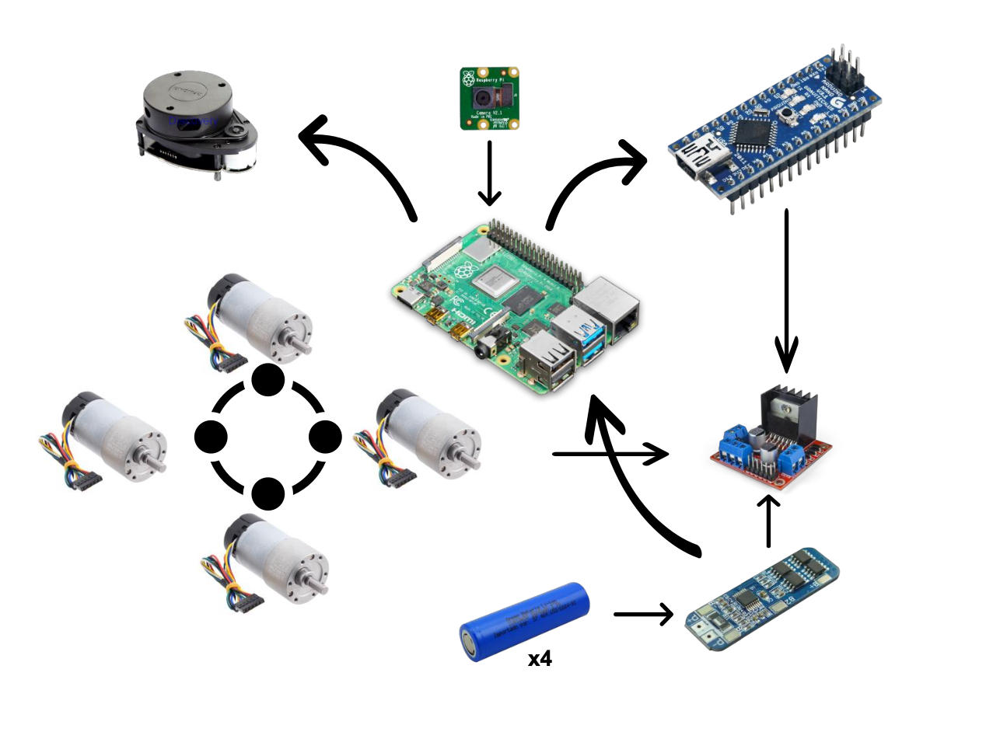
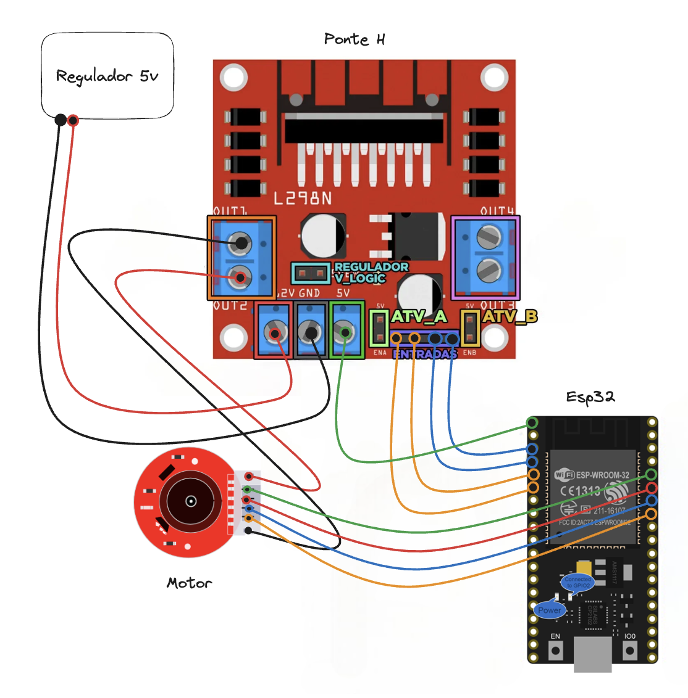

# Diagrama do Circuito

O diagrama apresentado ilustra uma versão base para a montagem do robô, representando os principais componentes envolvidos no projeto, excluindo fios, conectores e outros componentes adicionais que possam ser incorporados posteriormente. Essa estrutura simplificada foi concebida com o propósito de estabelecer uma base para as conexões e a disposição dos componentes essenciais do robô, permitindo uma visualização inicial da interação entre eles.

   > **Note** :
   > Inicialmente, o projeto incluía a utilização de uma câmera para reconhecimento facial. No entanto, devido a restrições orçamentárias, não foi viável implementar esse componente no momento.
   

A seguir, apresento o diagrama mais detalhado referente ao circuito do motor com encoders, o qual é o único circuito desenvolvido para o projeto em questão.

