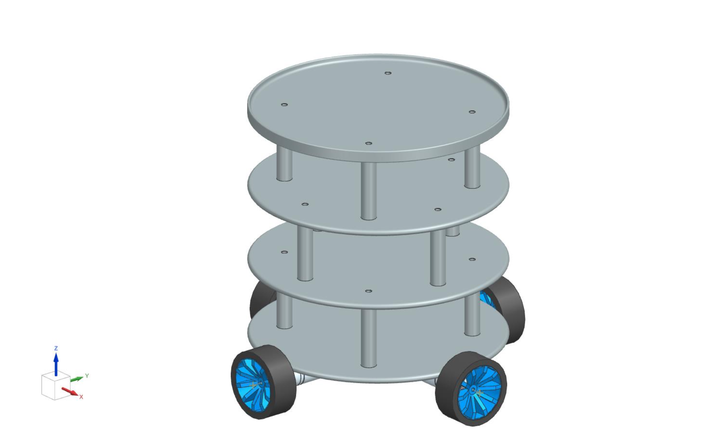

# Design do Robô

O design do robô foi cuidadosamente desenvolvido com base nas características do TurtleBot, que oferece vantagens em termos de simplicidade, modularidade e custo acessível. Essa escolha estratégica possibilita uma fácil manipulação e aprimoramento do robô ao longo do tempo, proporcionando flexibilidade e adaptabilidade.

Uma das principais características do design é a integração de quatro rodas omnidirecionais. Essa escolha permite que o robô se mova em qualquer direção, facilitando a sua locomoção e manobrabilidade. Com a capacidade de mover-se lateralmente, diagonalmente e girar no próprio eixo, o robô torna-se altamente versátil em ambientes variados.

A modularidade é um aspecto fundamental do design, permitindo a fácil integração de componentes eletrônicos, sensores e atuadores. Isso possibilita a incorporação de funcionalidades adicionais ao robô, como detecção de obstáculos, mapeamento e navegação autônoma. Além disso, a modularidade facilita a substituição ou atualização de componentes específicos, caso necessário, sem afetar todo o sistema do robô.

O baixo custo é um fator importante no projeto do robô, tornando-o acessível para uma ampla gama de aplicações. Ao utilizar componentes de custo acessível e materiais comuns, o projeto visa viabilizar a replicação e adoção do robô em diferentes cenários e projetos.

No geral, o design do robô baseado no TurtleBot oferece uma solução eficiente e flexível para a construção de um robô de baixo custo e de fácil manuseio. Ele combina a simplicidade do TurtleBot, a capacidade de movimentação das rodas omnidirecionais e a modularidade para possibilitar melhorias contínuas e personalizações de acordo com as necessidades específicas de cada projeto.

* BASE x3 – 250mm de Diâmetro, com 6 mm de espessura. 
* PILARES entre os andares – 70mm de altura, com 10mm de Diametro. 
* PRATO SUPERIOR – 250 de diâmetro com 6mm de espessura.

Para a construção dos andares do robô, será utilizado MDF com uma espessura padrão de 6mm, amplamente utilizado no mercado. Essa escolha proporciona uma boa resistência e durabilidade aos andares, ao mesmo tempo em que mantém um peso relativamente baixo. Os andares serão cortados com o auxílio de uma cortadora a laser da FEI, garantindo precisão nos cortes e um acabamento de qualidade.

Quanto aos pilares do robô, eles serão fabricados utilizando uma impressora 3D e o material escolhido é o ABS. O ABS é um material plástico comumente utilizado na impressão 3D devido à sua resistência e durabilidade. Essa escolha assegura a estabilidade e robustez dos pilares, fornecendo suporte adequado para os andares do robô.

Ao combinar o MDF cortado a laser com os pilares impressos em 3D de ABS, o projeto do robô busca equilibrar a resistência estrutural com a facilidade de fabricação. Essa abordagem permite a criação de um robô sólido e estável, capaz de suportar os componentes eletrônicos, sensores e atuadores necessários para o seu funcionamento adequado.