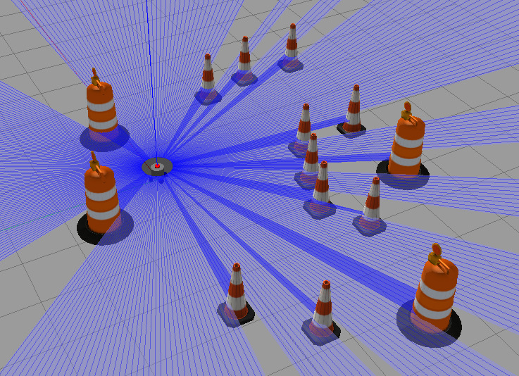

# Guia de Software
Este é um guia para usar e configurar o robô em simulação. A seguir estão os comandos e configurações necessários para diferentes cenários de uso.

## Iniciar o robô na simulação
Para iniciar o robô na simulação, você pode usar os seguintes comandos:

* **Iniciar o robô na simulação básica**

```bash
make tf
```


* **Iniciar o robô na simulação sem mundo**

```bash
make sim
```


* **Iniciar o robô na simulação com mundo**

```bash
make sim2
```



* **Iniciar o robô na simulação com SLAM**
Se você deseja iniciar o robô na simulação com SLAM (mapeamento e localização simultâneos), siga as etapas abaixo:

```bash
# terminal 1
make sim2
# terminal 2
make slam
```


* **Iniciar o robô na simulação com AMCL**
Para iniciar o robô na simulação com AMCL (Adaptive Monte Carlo Localization), siga as etapas abaixo:


```bash
# terminal 1
make sim2
# terminal 2
make amcl
```

* **Iniciar o robô na simulação com navegação**
Para iniciar o robô na simulação com navegação, siga as etapas abaixo:

```bash
# terminal 1
make sim2
# terminal 2
make navigation
```

* **Atualizar o Docker Hub**
Se você deseja atualizar o Docker Hub com as alterações feitas no robô, siga os comandos abaixo:

```bash
make build

make push-docker
``` 

Certifique-se de ter todas as dependências e requisitos de software instalados antes de executar os comandos acima.